# Hi there, I'm yuan ??

  

## About Me

- ?? Keep learning and building.
- ?? Bio: 花有重开日，人无再少年。
- ?? Location: Asia/Nanning
- ?? GitHub: [@zkite626](https://github.com/zkite626)

## Tech Stack

  
  
  
  
  

## Metrics

---

> Powered by [lowlighter/metrics](https://github.com/lowlighter/metrics)
