

# 👋 Hi there, I'm yuan

  

## ✨ About Me

- 🌱 Keep learning and building every day.
- 📝 Bio: 花有重开日，人无再少年。
- 🌏 Timezone: GuangXi Nanning
- 🔗 GitHub: [@zkite626](https://github.com/zkite626)
- 📫 Email: [jiyuan26@icloud.com](mailto:jiyuan26@icloud.com)

## 🧰 Tech Stack

  
  
  
  
  

## 📊 Metrics

### Overview

### Languages

### Isocalendar

